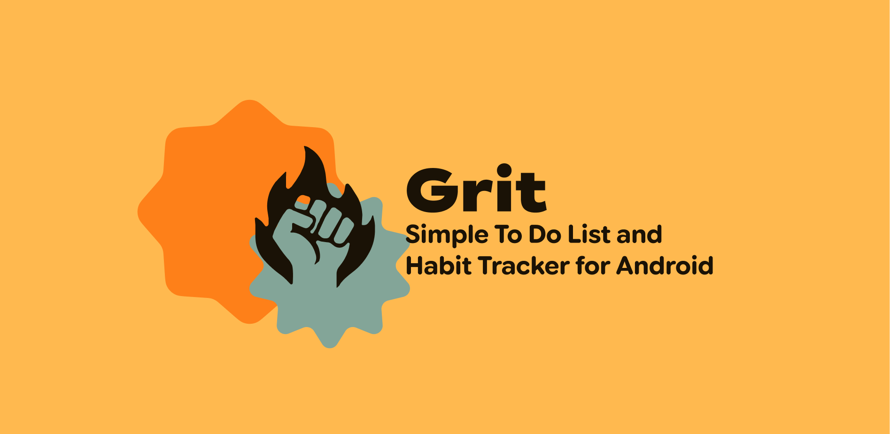
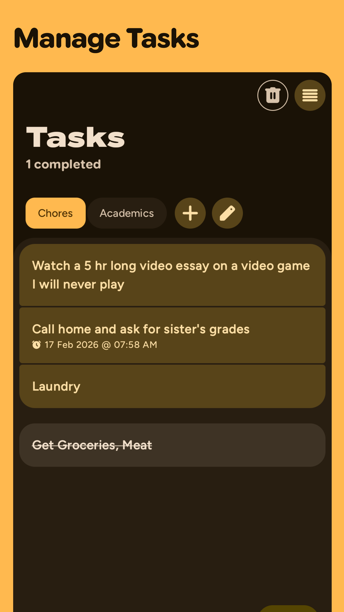
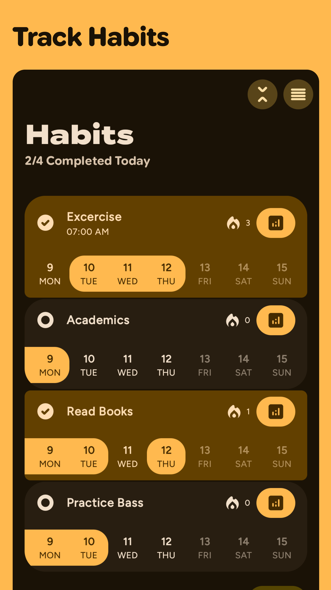
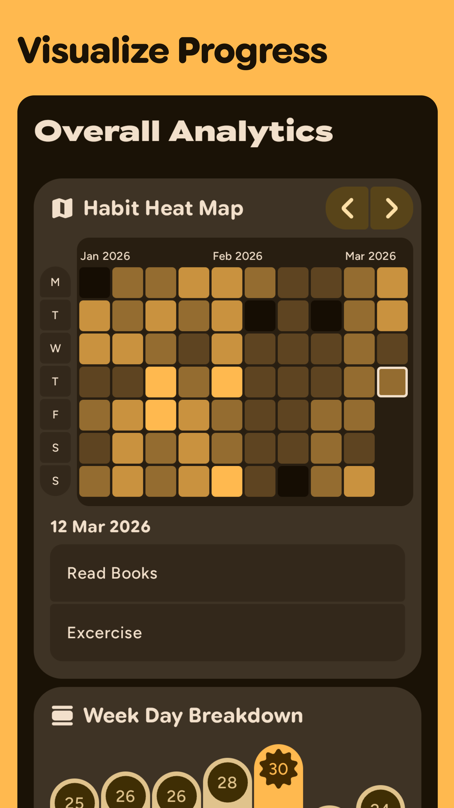
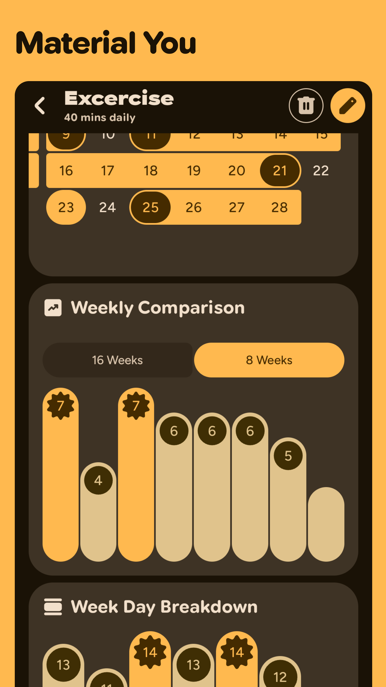
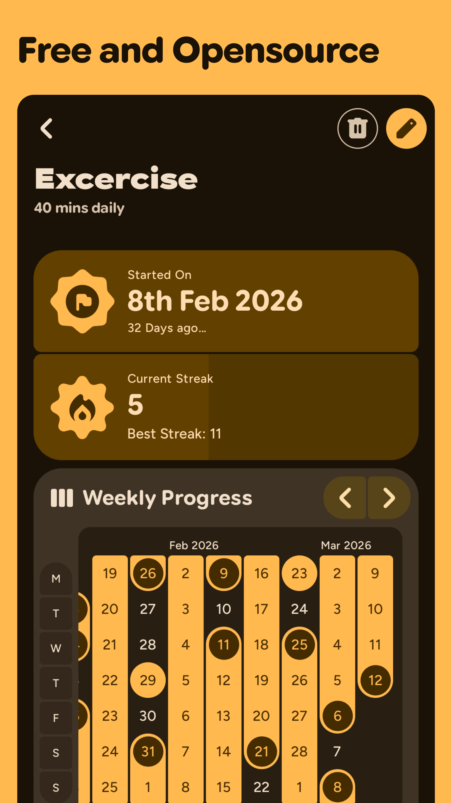
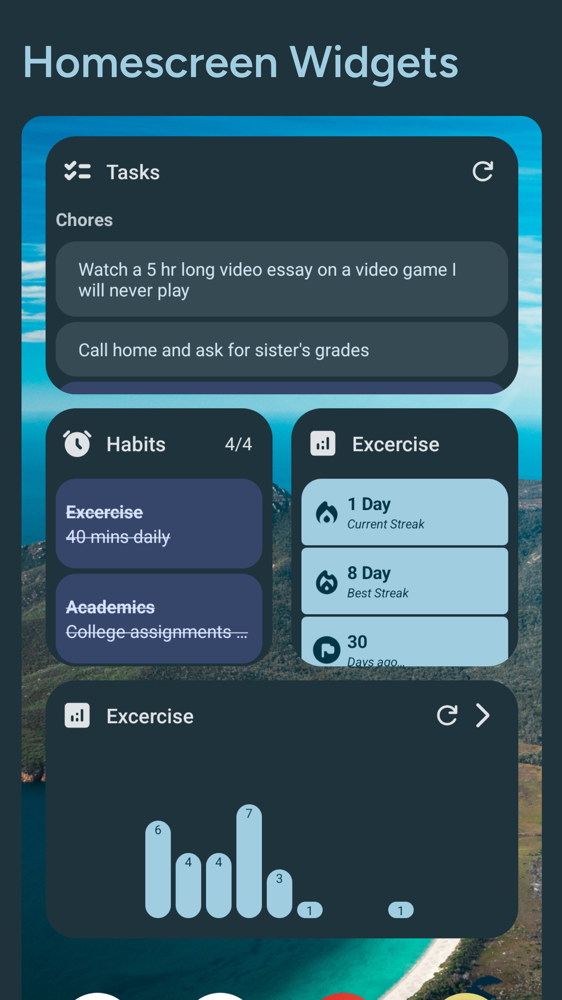

# Screenshots

|  |  |
|:-------------------------------------------------------------------------:|:-------------------------------------------------------------------------:|
|  |  |
|  |  |

# Features

- [x] Todo List with reminders
- [x] Daily Habit Tracking
- [x] Analytics with Habit Maps
- [x] Notification Reminders
- [x] Widgets

Check out planned changes in [RoadMap](https://github.com/shub39/Grit/discussions/66)

# Motivation 

There are plenty of todo list and habit tracker apps for android. Some have the features I love while some have good UI design.
While learning android I made this app for myself that brings together all the features that I like keeping everything simple. 
I eventually want to turn this app into a productivity hub with many social features like progress sharing in the form of beautiful cards.

# Stargazers over time

# Inspiration and Tech used

- [Loop Habit Tracker](https://github.com/iSoron/uhabits)
- Kotlin and Jetpack Compose 🖤
- Compose Multiplatform and Kotlin wasm for the Web Demo
- [Compose Charts](https://github.com/ehsannarmani/ComposeCharts)
- [Compose Reorderable](https://github.com/Calvin-LL/Reorderable)
- [MaterialKolor](https://github.com/jordond/MaterialKolor)
- [ColorPicker Compose](https://github.com/skydoves/colorpicker-compose)
- [Compose Icons](https://github.com/DevSrSouza/compose-icons)
- [Compose Calendar](https://github.com/boguszpawlowski/ComposeCalendar)
- [Revenuecat Android SDK](https://github.com/RevenueCat/purchases-android)