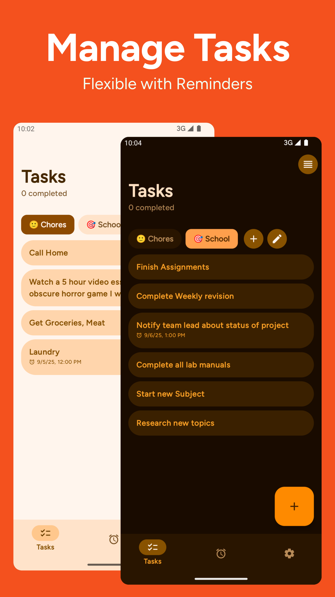
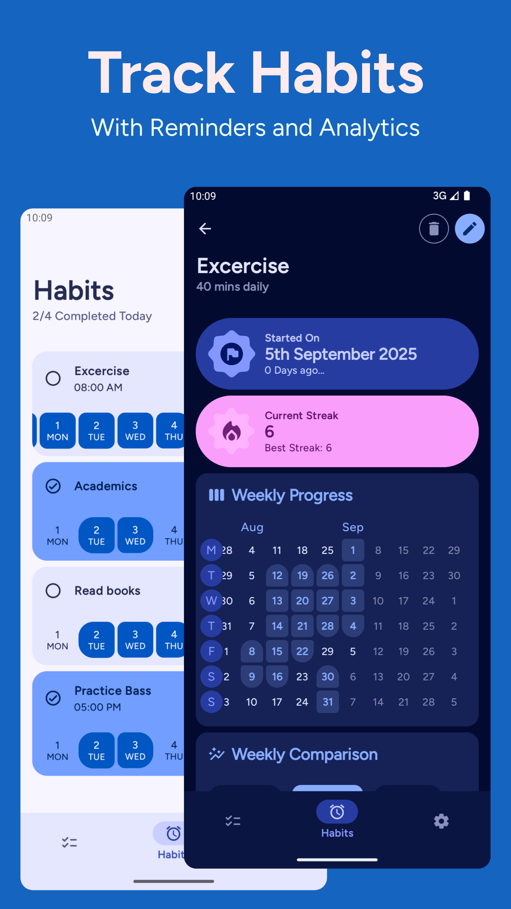

# Grit 
### A simple ToDo list and Daily Habit Tracker

> 
> 
> 

> ### Stats and Socials
> 
> 
> 

> ### Get On
> Check out [demo](https://shub39.github.io/Grit)
> 

## Screenshots 📱

|  |  |
|:-------------------------------------------------------------------------:|:-------------------------------------------------------------------------:|
|  |  |
|  |  |

## Features ✨
>- [x] Todo List with reminders
>- [x] Daily Habit Tracking
>- [x] Analytics with Habit Maps
>- [x] Notification Reminders
>- [x] Widgets

Check out planned changes in [RoadMap](https://github.com/shub39/Grit/discussions/66)

## Motivation 💭
There are plenty of todo list and habit tracker apps for android. Some have the features I love while some have good UI design.
While learning android I made this app for myself that brings together all the features that I like keeping everything simple. 
I eventually want to turn this app into a productivity hub with many social features like progress sharing in the form of beautiful cards.

## References and Inspiration 💡
>- [Loop Habit Tracker](https://github.com/iSoron/uhabits)

## Stargazers over time ✨
