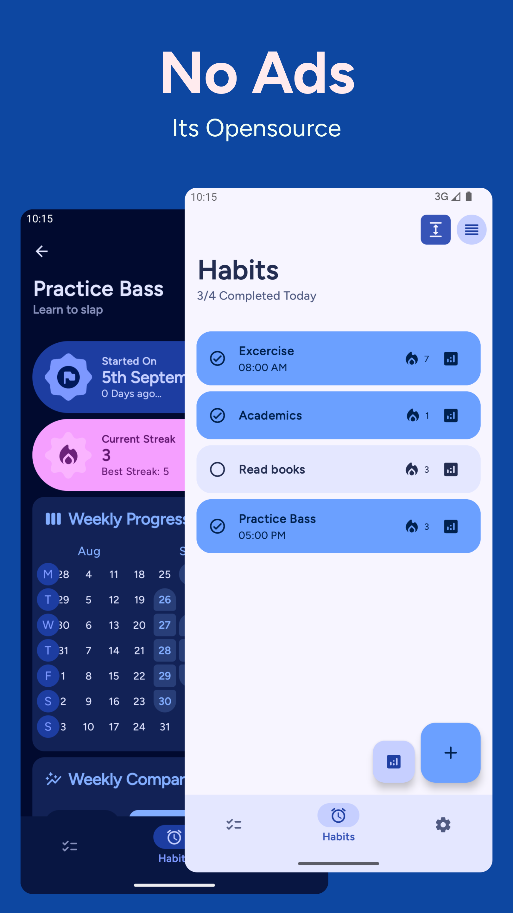

# Grit 
### A simple ToDo list and Habit Tracker

> [!NOTE]
> Due to being busy with other work, I'm short on time and motivation to add more features to this app
> because it's good enough for my use case and I like to work on other more exciting stuff with the little 
> free time I get. If you really like this app, please consider donating or contributing code

> 
> 
> 

> ### Stats and Socials
> 
> 
> 

> ### Get On
>
>
>### Or Download latest from [Releases](https://github.com/shub39/Grit/releases/latest)

## Screenshots 📱

|  |  |
|:-------------------------------------------------------------------------:|:-------------------------------------------------------------------------:|
|  |  |
|  |  |

## Features
>- [x] Todo List
>- [x] Habit Tracking
>- [x] Analytics with Habit Maps
>- [x] Notification Reminders
>- [x] Widgets

## Motivation 💭
There are plenty of todo list and habit tracker apps for android. Some have the features I love while some have good UI design.
While learning android I made this app for myself that brings together all the features that I like keeping everything simple. 
I eventually want to turn this app into a productivity hub with many social features like progress sharing in the form of beautiful cards.

## Tech Stack ⚒️

>- Material3 Design with Jetpack Compose
>- Database using ROOM Library
>- Alarm Manager API
>- Kotlin Coroutines
>- MVVM architecture
>- [Reorderable](https://github.com/Calvin-LL/Reorderable) for reorderable lists!
>- [Glance](https://developer.android.com/develop/ui/compose/glance/create-app-widget) for widgets
>- [MaterialKolor](https://github.com/jordond/MaterialKolor) for generating color palettes
>- [Colorpicker-compose](https://github.com/skydoves/colorpicker-compose) for the color picker

## Support 💕
> ### If you loved this app, consider donating. I'm an undergrad trying to get some pocket money
> 

## Stargazers over time ✨
