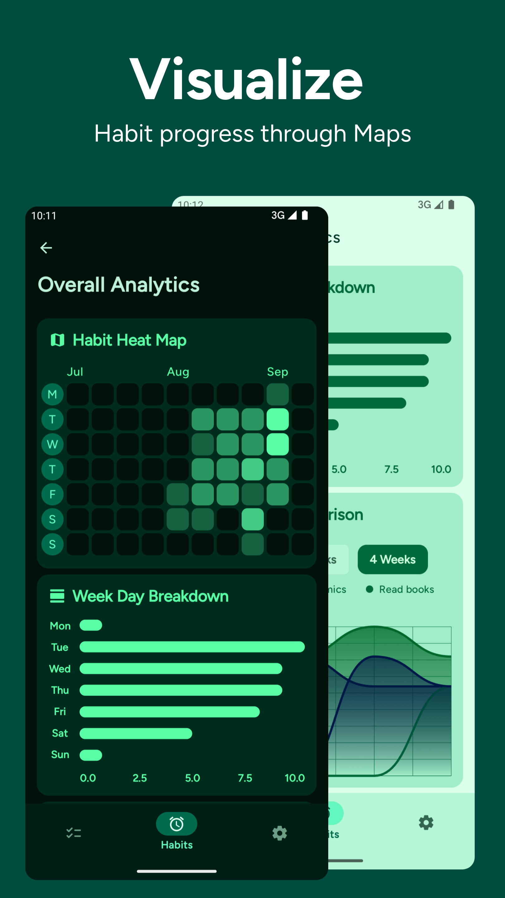
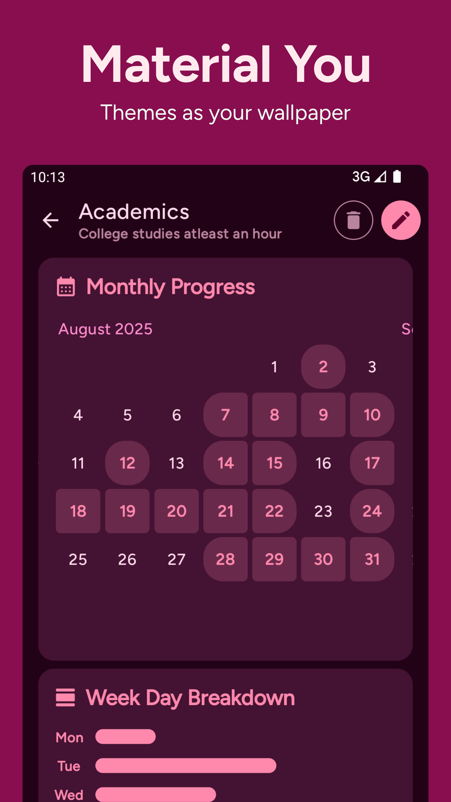

# Grit 
### A simple ToDo list and Habit Tracker

> 
> 
> 

> ### Stats and Socials
> 
> 
> 

> ### Get On
>
>
>### Or Download latest from [Releases](https://github.com/shub39/Grit/releases/latest)

## Screenshots 📱

|  |  |
|:-------------------------------------------------------------------------:|:-------------------------------------------------------------------------:|
|  |  |
|  |  |

## Features / Road Map 🛣️
>- [x] Todo List
>- [x] Habit Tracking
>- [x] Analytics
>- [x] Notifications
>- [ ] Widgets
>- [ ] Progress Sharing

## Motivation 💭
There are plenty of todo list and habit tracker apps for android. Some have the features I love while some have good UI design.
While learning android I made this app for myself that brings together all the features that I like keeping everything simple. 
I eventually want to turn this app into a productivity hub with many social features like progress sharing in the form of beautiful cards.

## Tech Stack ⚒️

>- Material3 Design with Jetpack Compose
>- Database using ROOM Library
>- Alarm Manager API
>- Kotlin Coroutines
>- MVVM architecture
>- [HeatMaps](https://github.com/shub39/HeatMaps) for Heat Maps!
>- [charts](https://github.com/tehras/charts) for making charts!

## Support 💕
> ### If you loved this app, consider donating. I'm an undergrad trying to get some pocket money
> 

## Star History 🌟

